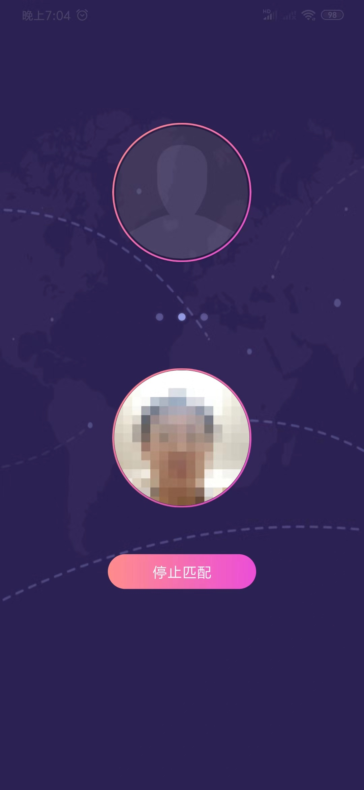

# likeMosaic

声网2020春季开发者大赛参赛作品，该应用可以让两个陌生人随机匹配进行视频聊天，并且使用马赛克的形式进行展示，通过增加好感度，马赛克级别会降低，知道已原始面貌交流。

## 效果图

|  |  |  |  |
| :-------------------: | :------------------: | :-----------------: | :------------------: |
|         首页          |        匹配中        |        聊天         |       选择话题       |

## 玩法

### 匹配

通过点击首页的“开始随机匹配”进行匹配，匹配成功会自动进入聊天页面。

### 聊天

双击顶部视频预览区给对方点赞，可以增加你对对方的好感度，好感度随着时间增加而降低，一旦好感度降低为0聊天就结束了。好感度越高，对方看到的画面越清晰。点击底部的话题可以向对方传达你期望聊天的话题，双方选择一样的话题会用粉色表示，否则是灰色的。

## 安装包

应用支持平台：Android

兼容性：支持Android SDK >= 17

下载链接：[https://github.com/Luomingbear/likeMosaic/releases/download/1.0/mosaic01.apk](https://github.com/Luomingbear/likeMosaic/releases/download/1.0/mosaic01.apk)

