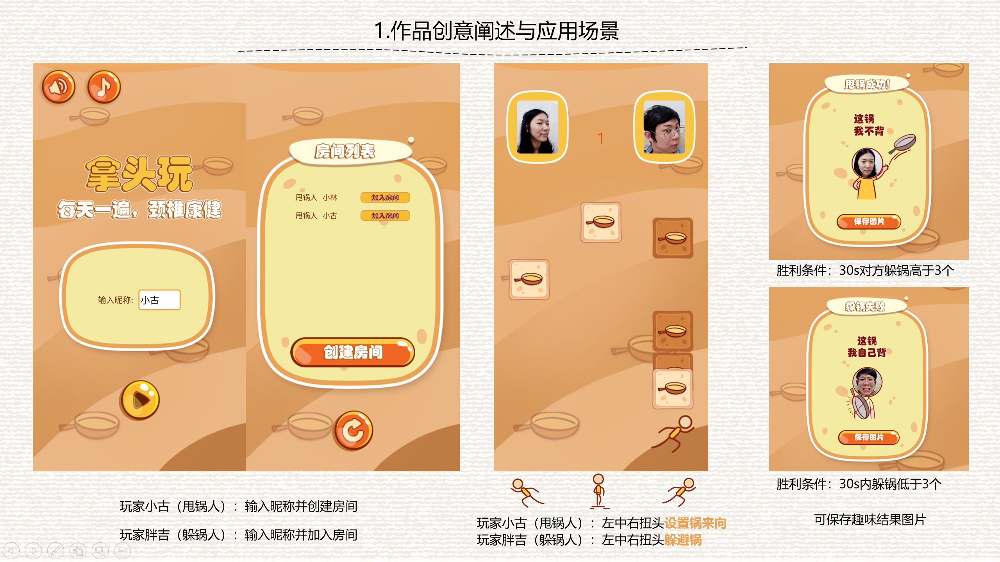

# 作品介绍
通过转动颈部，实时视频互动比赛的趣味游戏。通过扭头控住游戏中的小人左中右移动，接锅甩锅，实现在玩乐中自然活动颈部的效果。同时还能生成结果炫耀截图，融入“背锅”的梗，提升社交乐趣。游戏中的元素可复用替换，后续延展性强。

# 环境介绍
- kotlin  1.3.61
- ndk  21.0.6113669
- cmake  3.10.2
- java版本  1.8

# 编译方式

1. 前端：
- 在AppConfig.kt 中输入appKey
- 前往firebase 创建项目 并下载对应的 google-services.json 文件到app目录下

# 体验方式
运行 app_release.apk即可

# 作者
林达浩  温尧  古伊虹

