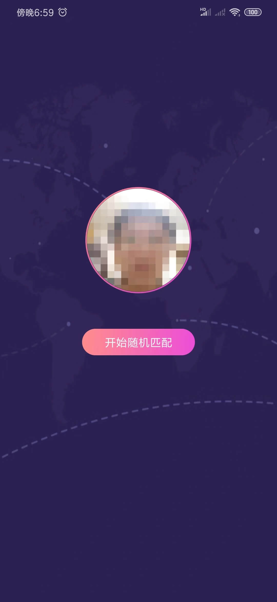
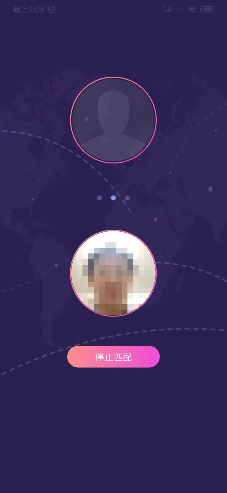
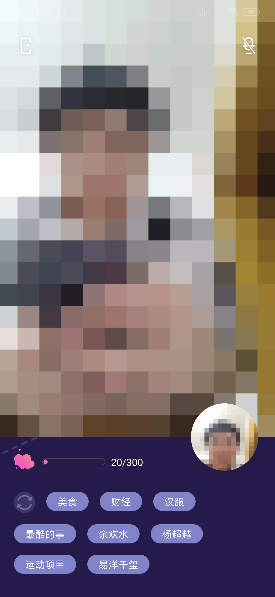
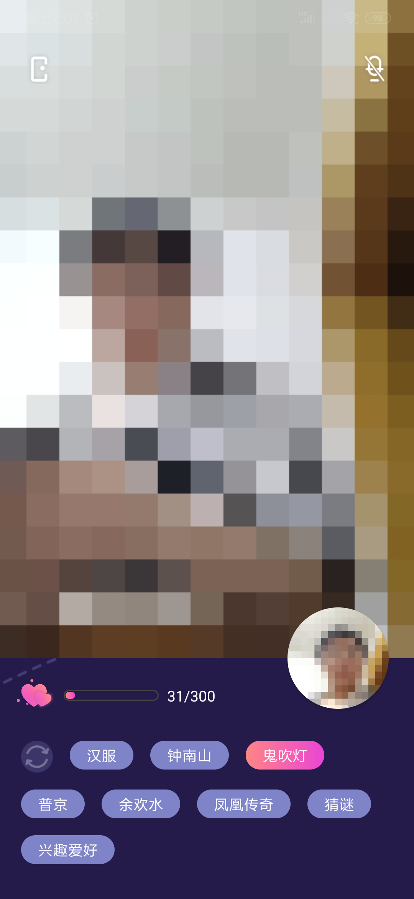

# Pixel Chat

声网2020春季开发者大赛参赛作品，该应用可以让陌生人随机匹配进行视频聊天，并且使用马赛克的形式进行展示，马赛克特效主要是为了降低陌生人交流时的尴尬和紧张感。通过增加好感度，马赛克级别会降低，直到以原始面貌交流。

## 效果图

|  |  |  |  |
| :-------------------: | :------------------: | :-----------------: | :------------------: |
|         首页          |        匹配中        |        聊天         |       选择话题       |

## 玩法

### 匹配

通过点击首页的“开始随机匹配”进行匹配，匹配成功会自动进入聊天页面，匹配超时会显示回默认样式。

### 聊天

双击顶部视频预览区给对方点赞，可以增加你对对方的好感度，好感度随着时间增加而降低，一旦好感度降低为0，聊天就结束了。好感度越高，对方看到的画面越清晰。点击底部的话题可以向对方传达你期望聊天的话题，双方选择一样的话题会用粉色表示，否则是灰色的。

## 使用的声网SDK
| SDK | 描述|
|---|---|
|视频通话SDK|实现用户间的视频通话功能|
|实时消息SDK|用于发送聊天中的好感度、话题选择等信息|

## 安装包

应用支持平台：Android

兼容性：支持Android SDK >= 17

下载链接：[https://github.com/Luomingbear/likeMosaic/releases/download/1.0/mosaic01.apk](https://github.com/Luomingbear/likeMosaic/releases/download/1.0/mosaic01.apk)

## 团队介绍
团队名：神隆架
团队成员及分工
| 成员 | 分工 |
|---|---|
| 周神 | 负责Flutter项目的开发和Android项目开发 |
| 朝仪 | 负责产品的UI设计、产品交互设计等 |
| 罗明 | 负责Android项目和服务端开发，负责马赛克算法实现 |

## 编译说明
整个项目文件夹说明如下，客户端目前仅有`Android`端，使用Android Studio开发，服务端使用SpringBoot开发。

```javascript
|-- android //Android项目的代码文件夹
|-- client //Flutter项目的代码文件夹，已经废弃
|-- server //服务端项目的代码文件夹
```

